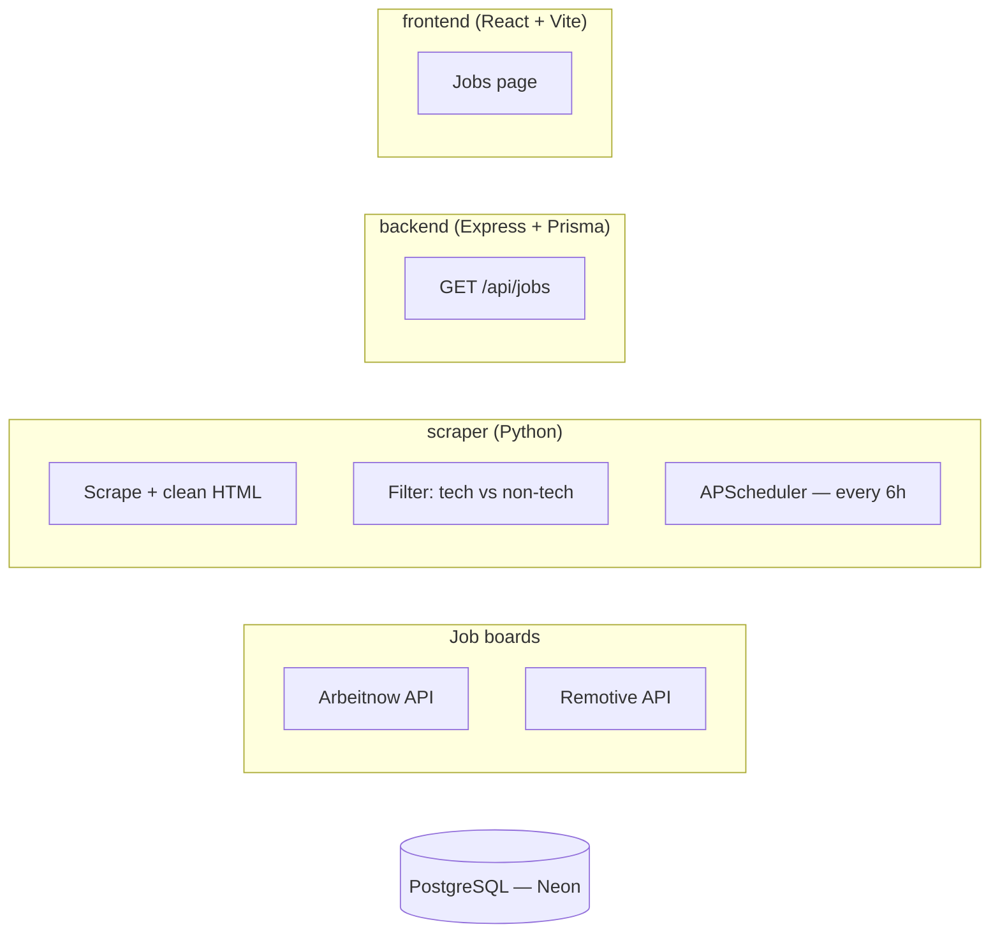

# TechJobs


A tech job aggregator. A Python scraper pulls listings from multiple job boards on a schedule, filters out non-technical roles, and stores them in Postgres. An Express API serves that data to a React frontend with clean filtering and pagination — no noise, just roles worth applying to.

## Architecture



The scraper and backend are independent processes that only share the
database — the scraper never talks to the API, and the API never scrapes.
This keeps ingestion (slow, scheduled, failure-prone) decoupled from serving
(fast, on-demand, always up).

## Monorepo layout

```
tech-jobs-portal/
├── frontend/    React 19 + Vite + Tailwind v4 + TanStack Query
├── backend/     Express 5 + Prisma 7 (REST API)
└── scraper/     Python — scheduled scraping, cleaning, filtering
```

Each project runs and is versioned independently; there's no shared build
step or workspace tooling tying them together.

## Features

- **Multi-source aggregation** — pulls from Arbeitnow and Remotive today;
  each scraper is a self-contained module, so adding a new source means
  adding a new function, not touching the pipeline.
- **Keyword-based tech filtering** — excludes sales/marketing/recruiting
  postings and keeps only roles matching a tech keyword set
  ([`filter.py`](scraper/src/utils/filter.py)).
- **HTML-safe descriptions** — job descriptions are stripped of markup and
  decoded before storage ([`cleaner.py`](scraper/src/utils/cleaner.py)).
- **Idempotent ingestion** — `url` is the unique key; re-scraping the same
  listing is a no-op (`ON CONFLICT (url) DO NOTHING`) rather than a
  duplicate row.
- **Paginated, searchable API** — `page`/`limit`/`search` query params, with
  `search` matching title or company (case-insensitive).
- **Scheduled runs** — APScheduler re-scrapes every 6 hours and once
  immediately on startup, so the dataset never goes stale.

## Tech stack

| Layer    | Stack |
|----------|-------|
| Frontend | React 19, Vite 8, TypeScript, Tailwind CSS v4, TanStack Query, Axios |
| Backend  | Express 5, Prisma 7 (`@prisma/adapter-pg`), TypeScript, `tsx` |
| Scraper  | Python 3.9, `requests`, BeautifulSoup4, APScheduler, `psycopg2` |
| Database | PostgreSQL (hosted on [Neon](https://neon.tech)) |

## Getting started

### Prerequisites

- Node.js 20+
- Python 3.9+
- A PostgreSQL database (this project uses [Neon](https://neon.tech)'s
  serverless Postgres)

The three services run as separate long-lived processes — use a separate
terminal per step, each starting from the repo root.

### 1. Database + Backend API

Create a Postgres database and grab its connection string — you'll use the
same `DATABASE_URL` for both `backend/` and `scraper/`.

```bash
cd backend
npm install
cp .env.example .env     # fill in DATABASE_URL
npx prisma db push       # syncs the schema — no migrations folder in this repo yet
npm run seed             # optional: a handful of sample jobs, without running the scraper
npm run dev              # http://localhost:5050
```

### 2. Frontend

```bash
cd frontend
npm install
npm run dev               # http://localhost:5173
```

### 3. Scraper

```bash
cd scraper
python3 -m venv venv
source venv/bin/activate  # Windows: venv\Scripts\activate
pip install -r requirements.txt
cp .env.example .env       # fill in the same DATABASE_URL

python src/main.py         # one-off scrape
python src/scheduler.py    # or: run continuously, every 6 hours
```


## Database schema

```prisma
model Job {
  id          Int      @id @default(autoincrement())
  title       String
  company     String
  location    String
  salary      String?
  jobType     String?
  remote      Boolean  @default(false)
  description String?
  url         String   @unique
  source      String
  postedDate  String?
  createdAt   DateTime @default(now())
}
```

## Known limitations

- The frontend's API base URL is currently hardcoded to
  `http://localhost:5050` ([`api/jobs.ts`](frontend/src/api/jobs.ts)) rather
  than read from an env var — fine for local dev, needs fixing before a
  real deploy.
- No test suite yet on any of the three services.
- "Saved jobs" isn't implemented — there's no auth or persistence for it,
  so it's intentionally left out of the UI rather than shown as a dead link.
